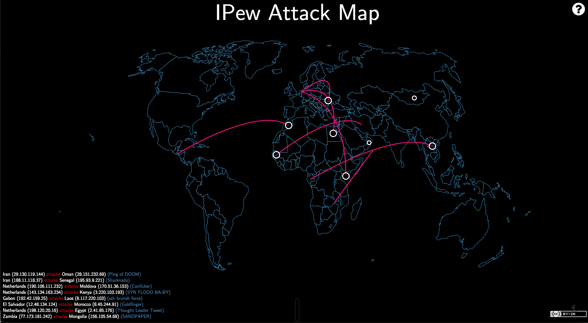

### IPew Attack Map

(a collaborative effort by @alexcpsec & @hrbrmstr)

Why should security vendors be the only ones allowed to use silly, animated visualizations to "compensate"? Now, **you** can have your very own IP attack map that's just as useful as everyone else's.

IPew is a feature-rich, customizable D3 / javascript visualization, needing nothing more than a web server capable of serving static content and a sense of humor to operate. It's got all the standard features that are expected including:

- _Scary_ dark background!
- Source & destination country actor/victim attribution!
- Inane attack names!

BUT, it has one critical element that is missing from the others: **SOUND EFFECTS**! What good is a global cyberbattle without some _cool_ sounds.

In all seriousness, IPew provides a simple framework - based on [Datamaps](http://datamaps.github.io/) - for displaying cartographic attack data in a (mostly) responsive way and shows how to use dynamic data via javascript event timers and data queues (in case you're here to learn vs have fun - or both!).

You can customize the display through a myriad of query string options, including _sounds_.

IPew includes the following sounds:

- no sound option set - Star Wars blaster! (guess which one!)
- `tng=1` - Star Trek:TNG Photons!
- `wargames=1` - WarGames key clicks!
- `b5=1` - Babylon 5 defense grid cannons!
- `pew=1` - Somewhat disturbing human-made "pew-pew" sound
- `galaga=1` - Classic arcade sound!

To turn off sound effects (but, but, _why?_ :-), use `nofx=1`, and to randomly cycle through them all use `allfx=1`

By default, IPew will use a statistical model for choosing source countries for the attacks, but you can level the playing field and set `random_mode=1` to give all countries the same cyber-advatage.

In similar vein, and using the perpsective many prominent security vendors and pundits seem to have, you can make all cyber attacks come from China with `china_mode=1` or from North Korea with `dprk_mode=1`.

IPew's default attack timing is based on observational data from many sources, but you can make it look like the world is on the brink of cyber collapse by setting `bad_day=1`.

Finally, you can proudly display your organization's name by setting `org_name=MyOrgName` (URL encode any spaces or special characters).

### Drill Mode

We had an interesting request to be able to use IPew in a IR "drill" setting, so there's now a "drill mode" where you can specify a latitude &amp; longitude to be the destination for the attacks. Right now, all attacks go there, but we may add an option to specify a percentage of attacks that should go there. You _must_ use `drill_mode=1&lat=##.####&lon=##.####` for this to work, like: `drill_mode=1&lat=43.2672&lon=-70.8617` (which would focus all attacks near @hrbrmstr). Remember, you can specify your organization name there, too. [Here's an example](http://ocularwarfare.com/ipew/index.html?org_name=hrbrmstr&drill_mode=1&lat=43.2672&lon=-70.8617).

One of my personal favorites is [http://ocularwarfare.com/ipew/index.html?china_mode=1&org_name=Mandiant&bad_day=1](http://ocularwarfare.com/ipew/index.html?china_mode=1&org_name=Mandiant&bad_day=1).

### Blame former employee mode

If you want to show that former employees are the problem, try out
employee_mode. You can set a first and last name for the employee and also
set a latitude and longitude.
[http://ocularwarfare.com/ipew/index.html?org_name=Verizon&employee_mode=1&employee_fname=Kevin&employee_lname=Thompson&lat=43.2672&lon=-70.8617](http://ocularwarfare.com/ipew/index.html?org_name=Verizon&employee_mode=1&employee_fname=Kevin&employee_lname=Thompson&lat=43.2672&lon=-70.8617)

### No activity

Just use `norse_mode=1` as a parameter

### Using IPew

Feel free to use the hosted version, but we've released IPew under a liberal Creative Commons license, so clone away and use as you see fit, just remember to share your creations (and code) with others.
